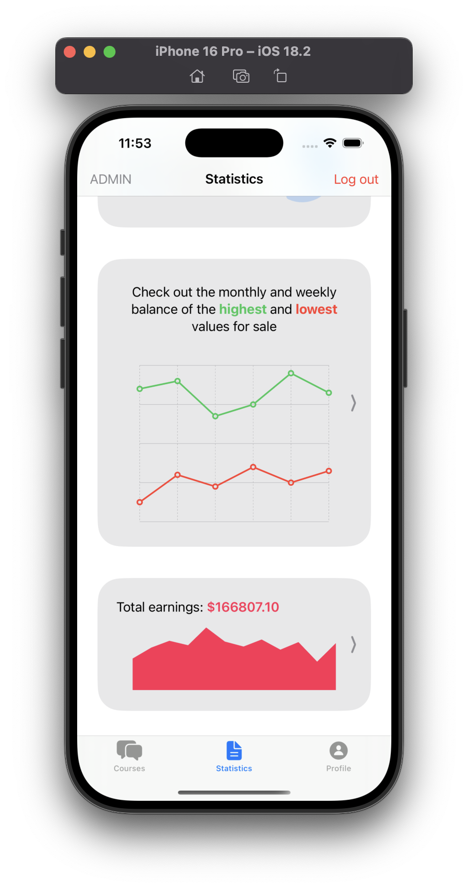
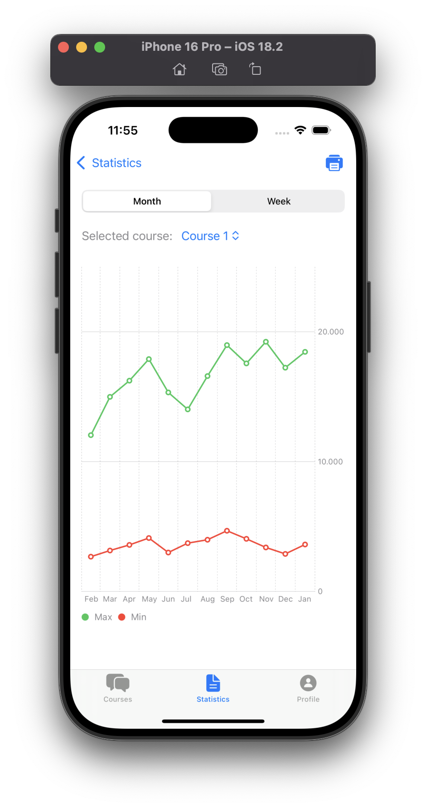
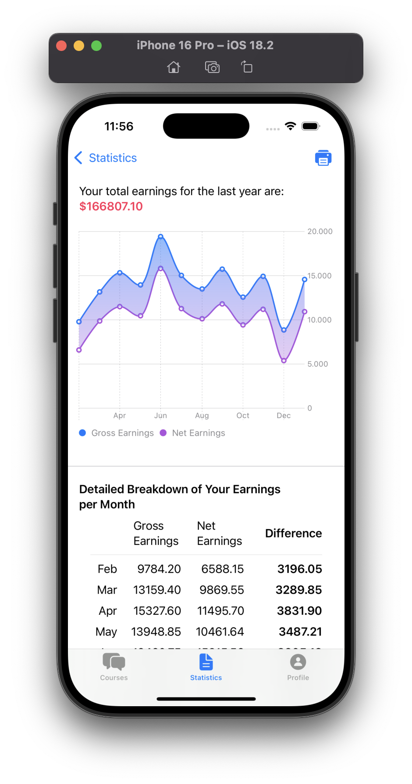

# Diplomski rad
Github repository for project that represents my final thesis at the Faculty of Software Engineering in Zenica in the subject Computer Graphics, on the topic "Creating a mobile application for visualizing statistical data"
### App preview

 

**NOTE**: Be aware that the screenshots are only a partial representation of the application. The project is still in the development phase.